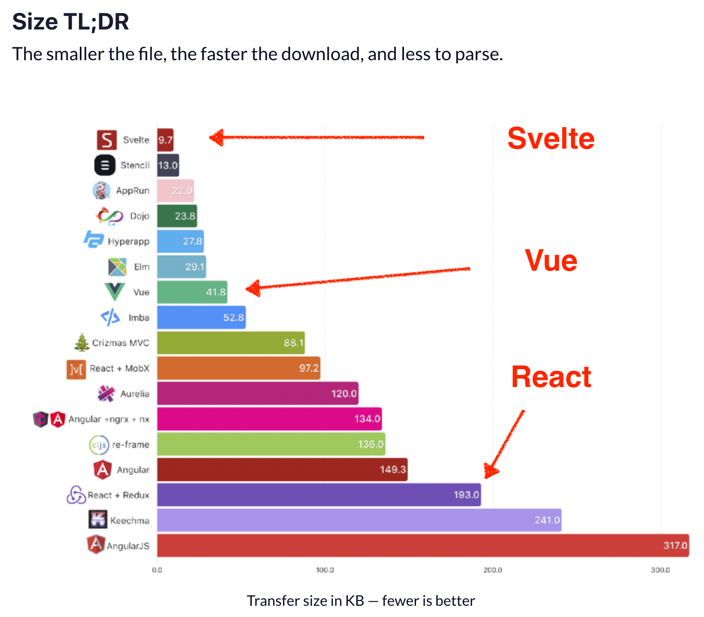
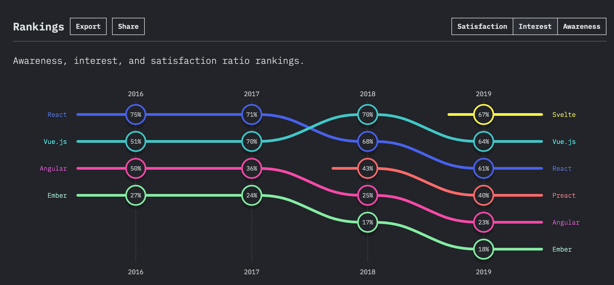
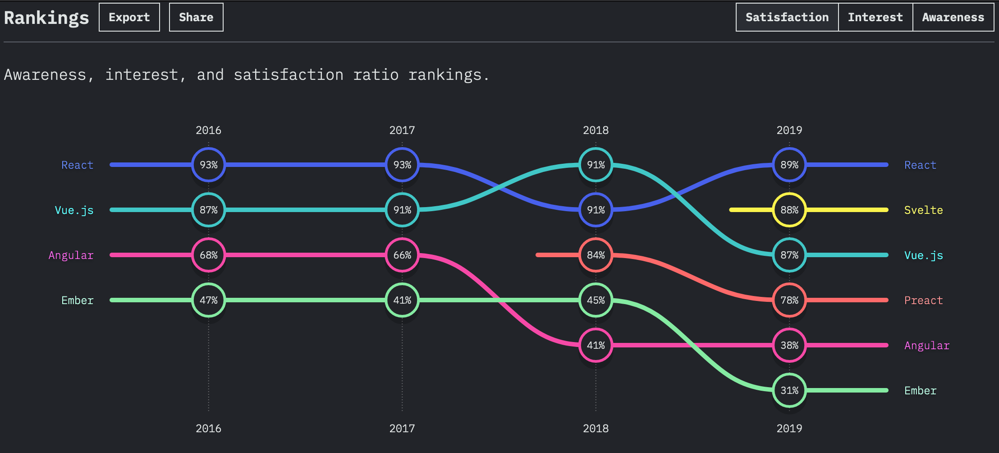
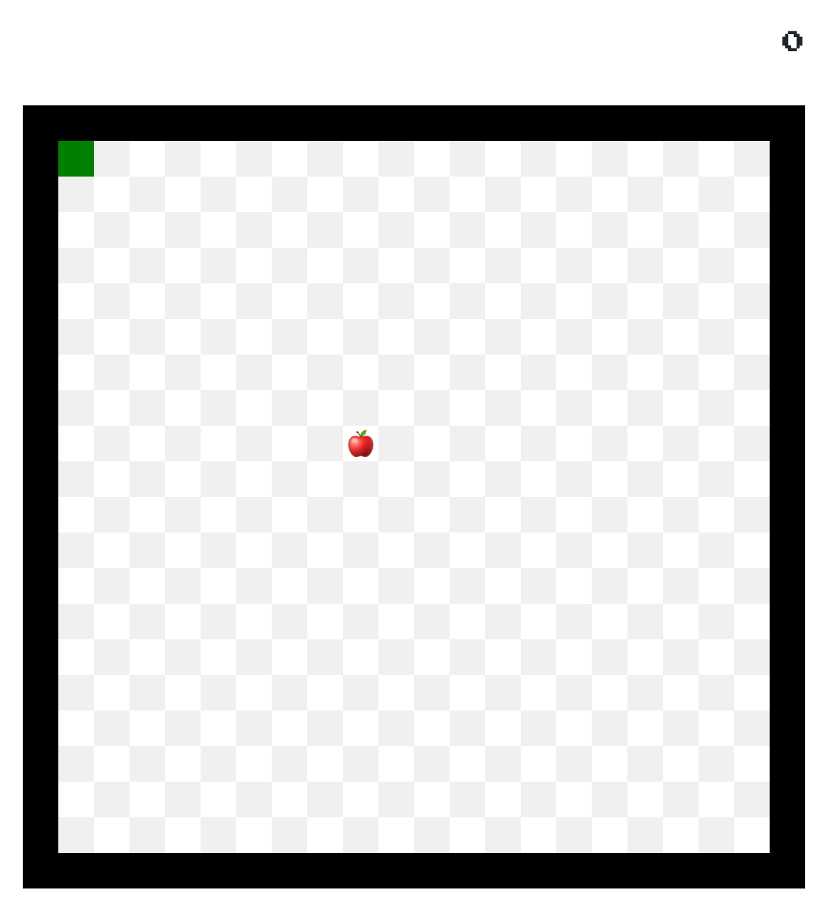
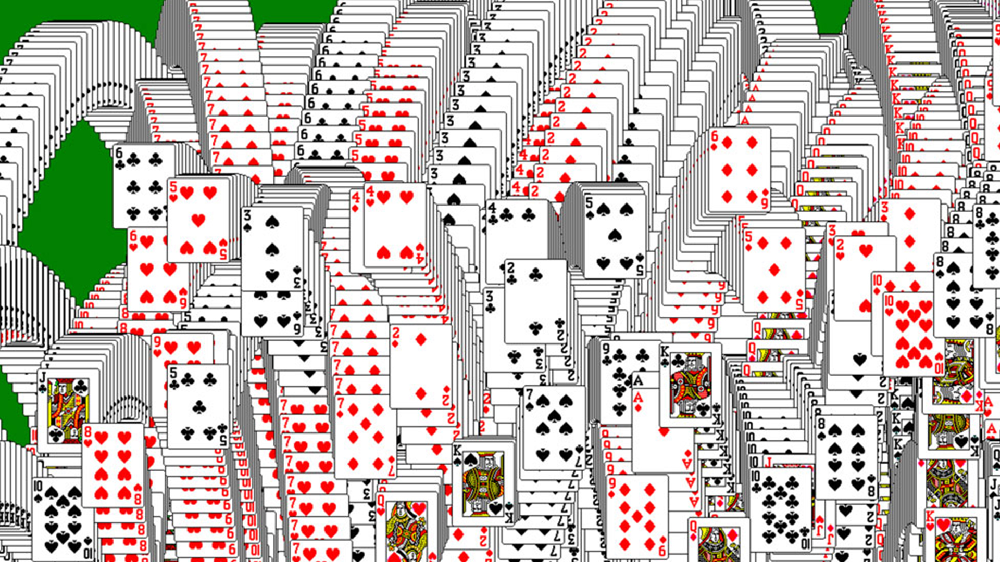

# Fun and Games with Svelte

En workshop av [Eirik Vågeskar](https://github.com/vages),
[Knowit Objectnet Oslo](https://knowitlabs.no/bli-kjent-med-de-nyansatte-i-knowit-solutions-oslo-be28140906d0)

<!-- prettier-ignore-start -->

<!-- toc -->

- [Intro: Vi skal lage spillet Snake i Svelte](#intro-vi-skal-lage-spillet-snake-i-svelte)
  * [Svelte](#svelte)
  * [Du må ha følgende på datamaskinen din](#du-ma-ha-folgende-pa-datamaskinen-din)
  * [Slik blir workshoppen](#slik-blir-workshoppen)
- [Del 1: Enkel grafikk](#del-1-enkel-grafikk)
  * [Opplæring: Slik ser en Svelte-fil ut](#opplaering-slik-ser-en-svelte-fil-ut)
  * [Oppgave 1.1: Plasser eplet](#oppgave-11-plasser-eplet)
  * [Opplæring: Each-blokker](#opplaering-each-blokker)
  * [Oppgave 1.2: Tegn slangekroppen på skjermen](#oppgave-12-tegn-slangekroppen-pa-skjermen)
  * [Oppgave 1.3: Trekk ut koordinat-utregningen i en funksjon](#oppgave-13-trekk-ut-koordinat-utregningen-i-en-funksjon)
- [Del 2: Spillkontroller](#del-2-spillkontroller)
  * [Opplæring: Å lytte etter input](#opplaering-a-lytte-etter-input)
  * [Oppgave 2.1: Lytt til trykk på tastaturet](#oppgave-21-lytt-til-trykk-pa-tastaturet)
  * [Opplæring: Å endre variabelverdier](#opplaering-a-endre-variabelverdier)
  * [Oppgave 2.2: Beveg slangen ett steg i den retningen brukeren trykker](#oppgave-22-beveg-slangen-ett-steg-i-den-retningen-brukeren-trykker)
- [Del 3: Logikk](#del-3-logikk)
  * [Opplæring: Dollartegnet i Svelte – reaktive utsagn.](#opplaering-dollartegnet-i-svelte-%E2%80%93-reaktive-utsagn)
  * [Oppgave 3.1: Gi poeng når slangen spiser eplet](#oppgave-31-gi-poeng-nar-slangen-spiser-eplet)
  * [Oppgave 3.2: Få slangen til å vokse når den spiser eplet](#oppgave-32-fa-slangen-til-a-vokse-nar-den-spiser-eplet)
  * [Opplæring: Svelte-komponenters livssyklus, pluss setInterval](#opplaering-svelte-komponenters-livssyklus-pluss-setinterval)
  * [Oppgave 3.3: Få spillet til å «tikke»](#oppgave-33-fa-spillet-til-a-%C2%ABtikke%C2%BB)
  * [Oppgave 3.4 Stopp tikking når slangen dør](#oppgave-34-stopp-tikking-nar-slangen-dor)
  * [Oppgave 3.5: Forhindre at slangen spiser seg selv](#oppgave-35-forhindre-at-slangen-spiser-seg-selv)
- [Del 4: Animasjon](#del-4-animasjon)
  * [Opplæring: If og else-blokker](#opplaering-if-og-else-blokker)
  * [Opplæring: Hvordan overganger fungerer](#opplaering-hvordan-overganger-fungerer)
  * [Oppgave 4.1: Animer eplet](#oppgave-41-animer-eplet)
  * [Oppgave 4.2: Legg på en hodeskalle når slangen dør](#oppgave-42-legg-pa-en-hodeskalle-nar-slangen-dor)
  * [Oppgave 4.3: Animer slangehodet](#oppgave-43-animer-slangehodet)
  * [Oppgave 4.4: Animer slangehalen](#oppgave-44-animer-slangehalen)
- [Del 5: Komponenter og nettverk](#del-5-komponenter-og-nettverk)
  * [Opplæring: Komponenter](#opplaering-komponenter)
  * [Oppgave 5.1: Lag en komponent som dukker opp ved spillslutt](#oppgave-51-lag-en-komponent-som-dukker-opp-ved-spillslutt)
  * [Advarsel: Resten av del 5 er vanskelig](#advarsel-resten-av-del-5-er-vanskelig)
  * [Opplæring: Await-blokker](#opplaering-await-blokker)
  * [Oppgave 5.2: Hent high-scores fra API-et](#oppgave-52-hent-high-scores-fra-api-et)
  * [Opplæring: Binde variabler til input-felter](#opplaering-binde-variabler-til-input-felter)
  * [Oppgave 5.3: Legg til et felt der folk kan fylle inn navnet sitt](#oppgave-53-legg-til-et-felt-der-folk-kan-fylle-inn-navnet-sitt)
- [Del 6: Game Over?](#del-6-game-over)
  * [Oppgave 6.1: Forbedre spillet](#oppgave-61-forbedre-spillet)
  * [Oppgave 6.2: Alternative spill](#oppgave-62-alternative-spill)
  * [Oppgave 6.3: Etter denne workshoppen](#oppgave-63-etter-denne-workshoppen)

<!-- tocstop -->

<!-- prettier-ignore-end -->

## Intro: Vi skal lage spillet Snake i Svelte


### Svelte

[Svelte](https://svelte.dev) er et bittelite webrammeverk.

#### Fordelene med Svelte

Applikasjonene man skriver i Svelte blir som regel
[mindre og raskere enn en tilsvarende applikasjon hadde blitt i React eller Vue](https://www.freecodecamp.org/news/a-realworld-comparison-of-front-end-frameworks-with-benchmarks-2019-update-4be0d3c78075/).




Og folk liker å jobbe med det:
[Ifølge State of JS 2019](https://2019.stateofjs.com/front-end-frameworks/#front_end_frameworks_experience_ranking)
er Svelte det rammeverket flest utviklere er interesserte i å bruke …



… og det som _nest flest_ er fornøyde med å bruke. Det skal sies at det er tett
i teten mellom React, Svelte og Vue, med henholdsvis 89, 88 og 87 prosents
oppslutning.



#### Ulempene med Svelte

Ulempen med Svelte er at ikke så mange bruker det (ennå).

### Du må ha følgende på datamaskinen din

- [yarn](https://classic.yarnpkg.com/en/docs/install/)
- [node](https://nodejs.org/en/)
- Noe å skrive kode i.
  - Vi anbefaler
    [en editor hvor du kan installere støtte for Svelte](https://github.com/sveltejs/integrations#editor-extensions).
- En klone av
  [Vages/svelte-snake-workshop](https://github.com/Vages/svelte-snake-workshop)

### Slik blir workshoppen

- Repoet
  [Vages/svelte-snake-workshop](https://github.com/Vages/svelte-snake-workshop)
  inneholder alt du trenger.
  - Du kan bestemme tempo selv.
  - Vi kommer til å gå gjennom svarene i fellesskap med ujevne mellomrom.
- Workshoppen er delt opp i 6 deler.
  - Det grunnleggende spillet er ferdig etter del 3.
  - De siste delene er bonuser.
- Hver oppgave starter med oppgavetekst, som av og til blir fulgt av hint.
  - Du kan la være å lese hintene om du trenger en ekstra utfordring.
- Bytt til `task-X-begin` før du løser hver nye oppgave `X`.
  - `task-X-end` er oppgavens fasit.
- Du kan be om hjelp så å si når som helst.
- Vi kommer ikke til å stoppe deg hvis du trykker på noen andres tastatur, men
  [er det så lurt, 'a](https://www.youtube.com/watch?v=IJNR2EpS0jw)?

**For å fokusere på kode fremfor utseende, får dere utdelt all styling.**

## Del 1: Enkel grafikk

Når denne delen er ferdig, skal vi ha et brett med en slange og et eple.

### Opplæring: Slik ser en Svelte-fil ut

Svelte er en forbedret versjon av HTML, CSS og Javascript. Om du kan disse fra
før, kan du bruke mye av det i Svelte.

I Svelte kan man skrive Javascript, CSS og HTML i én og samme fil. Delene kalles
for «script», «styling» og «template».

```html
<script>
  let answer = 42;
</script>

<style>
  div {
    font-weight: bold;
  }
</style>

<div>Hello world, the answer is {answer}</div>
```

Som vi akkurat hintet til, bruker man krøllparenteser inni HTML-delen av filen
for å sette inn variabler, utregninger og funksjonskall.

```html
<script>
  let answer = 42;
</script>

<div>Meningen med livet er {a}.</div>
<div>Kvadratet av meningen er {a * a}</div>
<div>Meningen med livet har {Math.sign(a)} som fortegn</div>
```

Løs
[oppgaven om å sette inn data fra Svelte-tutorialen](https://svelte.dev/tutorial/adding-data)
før du går videre.

### Oppgave 1.1: Plasser eplet

På brettet har vi en `<div class="apple" />`. Plasser dette eplet på det
koordinatet på brettet som ligger i variabelen `apple`. Størrelsen på hvert
koordinat er lagret i konstanten `CELL_SIZE`.

Vi sier at X-aksen går mot høyre, og Y-aksen peker ned.


Det det skal altså se ut som følger.



#### Hint: Style-attributtet

For å overstyre og legge til stil på elementer i HTML, kan man bruke attributtet
`style`. Inni style skriver man CSS.

`<div style="font-weight: bold;">Fet skrift</div>`

#### Hint: top og left i css

I CSS bruker man `top` og `left` for å forskyve elementer i henholdsvis `y`- og
`x`-retning i CSS

`<div style="top: 20px; left: 10px;">Forskjøvet</div>`

#### Hint: For å avsløre nesten alt

For å få til det med eplet, må du altså gjøre noe à la følgende:

```html
<div class="apple" style="left: {regnestykke1}px; top: {regnestykke2}px;" />
```

Til rådighet har du objektet som er lagret i apple. Du må benytte deg av
`apple.x` og `apple.y` samt `CELL_SIZE` for å få til disse regnestykkene.

### Opplæring: Each-blokker

Den kommende oppgaven kommer til å kreve en each-blokk.

Løs denne oppgaven fra Svelte-tutorialen for å lære hvordan
[en each-blokk fungerer](https://svelte.dev/tutorial/each-blocks).

### Oppgave 1.2: Tegn slangekroppen på skjermen

Du skal nå tegne slangen på brettet.

Slangen er en samling koordinater og ligger i variabelen `snake`. Det første
elementet er hodet.

Hvert koordinat i kroppen skal tegnes som en `<div class="body-part" />`.

### Oppgave 1.3: Trekk ut koordinat-utregningen i en funksjon

Kalkulasjonene som gjøres for å visualisere noe på brettet via styles virker
repetativt og vil være vanskelig å refaktorere (x\*CELLSIZE), flytt dette over
til en egen funksjon `calculatePositionAsStyle(coordinate)`. Den skakl returnere
en streng med verdier for top og left.

## Del 2: Spillkontroller

Når du er ferdig med del 2, skal det gå an å styre slangen med piltastene slik
at den beveger seg over skjermen.

### Opplæring: Å lytte etter input

Løs følgende oppgaver fra Svelte-tutorialen før du går videre:

- [Lytte etter DOM-hendelser på et element](https://svelte.dev/tutorial/dom-events)
- [Lytte etter DOM-hendelser på selve vinduet](https://svelte.dev/tutorial/svelte-window)

### Oppgave 2.1: Lytt til trykk på tastaturet

I denne oppgaven skal du lytte etter trykk på tastaturet og sende dem videre til
funksjonen `console.log`. NB: Applikasjonen skal kunne «høre» tastetrykk uansett
hvilken del av nettsiden som har fokus, altså skal ikke brukeren behøve å ha
fokus på en spesifikk knapp for at tastetrykkene skal bli registrert.

Vi vil helst bare lytte på nettsiden, altså `document.body`, ikke vinduet (som
er det `svelte:window` representerer).

#### Hint: Tastetrykk-hendelsen

Tastetrykk-hendelsen heter `keydown`. I Svelte lytter man etter den med
`on:keydown`.

#### Hint: svelte:body

For å kunne registrere tastetrykk, må vi lytte på `document.body`. Dette får vi
til ved å bruke elementet `<svelte:body />`. Du kan lytte etter hendelser på `svelte:body` akkurat
slik du ville gjort med et annet HTML-element.

### Opplæring: Å endre variabelverdier

Du kommer til å måtte vite hvordan du endrer variabler i den kommende seksjonen.
Gjør følgende oppgaver fra Svelte-tutorialen før du fortsetter:

- [Oppdatere vanlige variabler](https://svelte.dev/tutorial/reactive-assignments)
- [Oppdatere arrays og objekter](https://svelte.dev/tutorial/updating-arrays-and-objects)

### Oppgave 2.2: Beveg slangen ett steg i den retningen brukeren trykker

Nå skal vi oversette tastetrykkene til bevegelse. Hver gang man trykker på en
piltast, skal slangen bevege seg ett steg i den retningen som tasten peker.

For å gjøre det litt enklere, har vi laget en funksjon
`getNewDirectionFromEventKey` i `utils.js`, som oversetter fra tastetrykk til en
bevegelsesvektor.

Tilleggsopplysninger:

- Inntil videre kan du bevege slangen, uansett om den går inni seg selv eller
  utenfor brettet.
  - Vi skal tenke på game over senere.
- Unngå at slangen beveger seg ved trykk på _andre_ taster enn piltastene, WASD
  og lignende.
- I kodebasen har vi valgt å bruke kompassretningene for å vise til retningene
  på brettet.
  - Vest er venstre, nord er opp.

#### Hint: Viktige Array-funksjoner

- Den enkleste måten å legge til elementer i starten eller slutten i et array
  på, er å bruke spredning (_spreading_): `[a, ...b]`.
- Funksjonen
  [Array.prototype.slice](https://developer.mozilla.org/en-US/docs/Web/JavaScript/Reference/Global_Objects/Array/slice)
  er nyttig når man kappe av elementer fra starten og slutten av et array. Og et
  lite kjent triks: Ved å bruke en negativ indeks som andre argument, regnes
  indeksen fra slutten, altså fører `foo.slice(0, -1)` til at du kapper av siste
  element.

#### Hint: Hjelpemidler i `utils.js`

I utils.js finner du:

- `add(coordinateA, coordinateB)`, som kan legge sammen to vektorer/koordinater
  (forfatterne vet forskjellen, men dette er ikke et mattekurs).
- `DIRECTION_VECTORS`, som man kan bruke for å gå fra kompassretning til
  retningsvektor.

Legg til linjen `import { add, DIRECTION_VECTORS } from './utils'` øverst i
`<script>` for å bruke dem.

## Del 3: Logikk

Når du er ferdig med denne delen, skal det gå an å få poeng. Spillet skal stoppe
hvis slangen er på en ulovlig posisjon. Og spillklokka skal tikke — slangen vil
altså bevege seg på gitte tidspunkter, heller enn når du trykker på piltastene.

### Opplæring: Dollartegnet i Svelte – reaktive utsagn.

#### Reaktive utregninger

Du lærte _sannsynligvis_ å programmere på barneskolen – ja, jeg snakker til deg,
gjennomsnittlige student. Det var bare så lett at _ingen_ anerkjente det. For
nesten alle barn i Norge lærer Microsoft Excel.

I Excel kan man skrive formler i cellene, for eksempel `=A1*B3`. Da blir cellens
verdi lik resultatet av regnestykket, og resultatet oppdaterer seg automatisk
etterpå. Slik er det ikke vanligvis i programmering; man kan ikke si
`a = 2; b = a * 2; a = 8` og regne med at `b` er 16 i stedet for 4, men slik er
det i Excel – og i Svelte.

I Svelte kan man få variabler til å oppdatere seg automatisk ved å sette et
dollartegn foran utregningen av den.

```js
let b = 3;
let c = 4;

$: a = (b * c) / 2; // a === 6
b = 6;

// I vanlig programmering ville a fortsatt vært 6,
// men i Svelte: a === 12

c = 8;
// … og nå: a === 24
```

Dette kalles _reaktivitet_, fordi kodesnutten «reagerer» på noe annet.

Løs
[oppgaven om reaktive utsagn fra Svelte-tutorialen](https://svelte.dev/tutorial/reactive-statements)
før du går videre.

#### Reaktive utsagn

Nesten være hva som helst som står etter dollartegnet. Man kan også skrive
funksjonskall og if-setninger:

```js
let lastUserInput = "";
$: if (lastUserInput === "hello") {
  console.log("hello to you too"); // Svarer når brukeren skriver inn strengen hello
}
```

```js
function parrot(something) {
  console.log(something);
  console.log("sqawk!");
}

let lastUserInput = "";
$: parrot(lastUserInput); // Gjentar alt brukeren sier, fulgt av papegøyelyd
```

Det som står bak dollartegnene blir kjørt når – og _bare når_ – verdien av det
som den avhenger av endrer seg. Med litt eksperimentering vil du skjønne hva som
er en avhengighet og ikke.

**Noter deg dette**:

- Når du skriver spill-logikk, kan du ofte oversette regler nesten direkte til
  kode: «Hvis `x === foo`, så gjør a, b og c» blir til
  `$: if (x === foo) { a(); b(); c(); }`.

Løs
[oppgaven om reaktive utsagn fra Svelte-tutorialen](https://svelte.dev/tutorial/reactive-statements)
før du går videre.

### Oppgave 3.1: Gi poeng når slangen spiser eplet

- Lag en variabel `score`. Dette er antallet epler slangen har spist.
- Du skal skrive en betingelsessetning som sier at når slangehodet er på samme
  koordinat som eplet, øker antallet poeng med 1.
- Gi eplet en ny plassering på brettet

Merk: Dette er kanskje den oppgaven der man sparer _mest_ knot ved bare å bruke
hjelpefunksjoner fra utils.js.

#### Hint: Hjelp i utils.js

I utils.js finner du funksjonen `isEqual` som sier deg om to koordinater er
like, og funksjonen `getNewApplePosition`, som henter en passelig posisjon for
det nye eplet.

### Oppgave 3.2: Få slangen til å vokse når den spiser eplet

Når slangen treffer eplet, skal den vokse neste gang den beveger seg.

For å gjøre det lettere for deg, har vi trukket ut logikken for å regne ut neste
slange i funksjonen `getNextSnake(snake, direction, ?shouldGrow)`. `shouldGrow`
er et valgfritt tredje argument, og er en boolsk.

Fokuser altså på når slangen skal vokse – og når den ikke skal det.

### Opplæring: Svelte-komponenters livssyklus, pluss setInterval

For å løse den kommende oppgaven, kommer du til å måtte kunne det du lærer av
følgende oppgaver i Svelte-tutorialen:

- [Oppgaven om onMount](https://svelte.dev/tutorial/onmount)
- [Oppgaven om onDestroy](https://svelte.dev/tutorial/ondestroy) (som inkluderer
  litt om setInterval)

### Oppgave 3.3: Få spillet til å «tikke»

I stedet for at slangen beveger seg når man trykker på piltastene, skal den
bevege seg med faste tidsintervaller. I demoversjonen av spillet er
tidsintervallet 100 ms, men du kan velge intervall selv.

### Oppgave 3.4 Stopp tikking når slangen dør

Det finnes to måter slangen kan dø på: Ved at den er utenfor brettet eller ved
at den spiser seg selv. Sørg for å stoppe tikkingen dersom enten av disse
inntreffer. For å stoppe tikkingen, har vi trukket ut en funksjon `stopTicking`
som du kan bruke.

Og en liten nøtt: Dette skal _ikke_ gjøres som en del av `moveSnake`-funksjonen
– det skal gjøres på rotnivået i script som en _reaksjon_ på at slangen beveger
seg.

#### Hint: Hjelpefunksjoner

I utils.js finner du `isInsideBoard` og `isSnakeEatingItself`. Disse vil være
til stor hjelp.

#### Hint: Reaktivitet

Husk reaktivitet og if-setninger: `$: if (x) { … }`, og hvordan man nesten
ordrett kan oversette spill-logikk til dette.

Hvis jeg skulle formulert reglene for game over muntlig, hadde jeg sagt noe
slikt som:

- «Hvis slangen ikke er innenfor brettet eller slangen spiser seg selv, er det
  game over»
- «Hvis det er game over, stopper tikkingen»

### Oppgave 3.5: Forhindre at slangen spiser seg selv

Idet du har fått game over til å funke, kommer du fort til å oppdage et problem:
Slangen dør ved å «spise seg selv» hvis du prøver å ta en U-sving og trykker
begge taster innenfor samme «tikk». Dårlig brukeropplevelse &rarr; sinte
spillere. Gjør det umulig å snu 180 grader rett inn i seg selv.

Du kan få hjelp av en funksjon i utils, `is180Turn(snake, newDirection)`, til å
unngå dette problemet. Eller løs problemet selv, om du trenger en utfordring.

## Del 4: Animasjon

Det grunnleggende spillet er ferdig. Neste steg er animasjon.

I Svelte følger pakken `svelte/transition` med. Den gjør at man kan animere et
element som dukker opp eller forsvinner.

Når denne delen er over skal vi ha en animert hodeskalle, eple og slange.

### Opplæring: If og else-blokker

- [If-blokker](https://svelte.dev/tutorial/if-blocks)
- [Else-blokker](https://svelte.dev/tutorial/else-blocks)

### Opplæring: Hvordan overganger fungerer

- [transition-attributtet](https://svelte.dev/tutorial/transition)
- [Hvordan man kan legge parametere på overganger](https://svelte.dev/tutorial/adding-parameters-to-transitions)
- [Forskjellig animasjon på inn og ut](https://svelte.dev/tutorial/in-and-out)

### Oppgave 4.1: Animer eplet

Nå skal du animere animere når nye epler dukker opp.

Du skal legge på overgangen `scale` ved å importere denne fra
`svelte/transition`. Denne overgangen skal _bare_ vises når eplet dukker opp. Du
kan forresten prøve ut
[flere overganger](https://svelte.dev/docs#svelte_transition), men `scale` er
altså fasit.

Fordi overganger bare fungerer når et element forsvinner eller dukker opp, er du
nødt til å trikse slik at et nytt eple tar over for det gamle hver gang. Trikset
er ikke spesielt vanskelig, men det kan kreve en aha-opplevelse. Spoiler
nedenfor.

#### SPOILER ALERT: Hint om hvordan du skal bytte ut eplet

Du kan bruke score modulo to, altså `score % 2`, i en if-else-blokk (der if og
else-tilfellene har lik output) for å veksle mellom to epler.

### Oppgave 4.2: Legg på en hodeskalle når slangen dør

I stylingen finnes det en klasse `skull`.

Når slangen dør, skal en `<div/>` med klassen `skull` dukke opp, og den skal ha
samme koordinat som slangehodet.

For å animere hodeskallen, legg på en `transition:scale` med en forsinkelse på
300 ms.

### Oppgave 4.3: Animer slangehodet

I CSS-en finnes det en klasse `head`. Denne sørger for styling og animasjon av
hodet så lenge man setter den på et element med klassen `body-part` . Legg inn
et animert slangehode ved hjelp av denne klassen.

Merk: Du kommer ikke til å trenge å bruke noe `transition:…` her – CSS-en tar
seg av animasjonen så lenge du legger riktig klasse på rett sted.

### Oppgave 4.4: Animer slangehalen

Nå skal vi animere halen. Det finnes en klasse, `tail`, som man kan legge på et
element for å få den samme gli-animasjonen som for hodet, men uten forstørrelse
av kroppsdelen.

Legg til en animert hale på slangen.

Merk:

- **Det er en rendering-bug i Safari og Chrome** som blir bedre av en workaround
  for i fasiten (som vi ikke kan fortelle hvordan virker, fordi den avslører
  løsningen).
  - Om du bruker Safari eller Chrome, kan du regne oppgaven som løst når du har
    en animert, litt blinkete hale.
  - Dersom du bruker Firefox, vil du sannsynligvis ikke merke noe.

## Del 5: Komponenter og nettverk

I denne delen skal vi lage en game-over skjerm. Denne skal hente high-scores fra
en (simulert) server. Du skal også kunne poste nye high-scores til serveren.

### Opplæring: Komponenter

Gjør følgende oppgaver fra Svelte-tutorialen:

- [Nøstede komponenter](https://svelte.dev/tutorial/nested-components)
- [Å erklære props](https://svelte.dev/tutorial/declaring-props)

### Oppgave 5.1: Lag en komponent som dukker opp ved spillslutt

Det ligger en fil klar, GameOver.svelte. Du skal sørge for at den vises på
skjermen og at den viser scoren som spilleren fikk.

PS: Fordi det er litt knotete å få denne til å vises på skjermen på en elegant
måte, har vi lagt inn noen div-er nederst der du kan montere
`<GameOver>`-komponenten.

### Advarsel: Resten av del 5 er vanskelig

Resten av oppgavene i del 5 er for folk som har erfaring med nettverkskall,
promises og lignende i Javascript. De kommer også til å kreve litt mer
egen-tenking enn de tidligere oppgavene.

Om du synes oppgavene blir for vanskelige å løse, anbefaler vi at du hopper
videre til del 6.

### Opplæring: Await-blokker

I Javascript-finnes det noe som heter _promises_ – «løfter» eller «lovnader», på
godt norsk. Et _promise_ brukes til å representere en operasjon man venter på.
Utfallet kan enten være vellykket eller feil. Den vanligste bruken av promises
er til nettverksforespørsler.

Løs
[oppgaven om await-blokker fra Svelte-tutorialen](https://svelte.dev/tutorial/await-blocks)
før du går videre.

### Oppgave 5.2: Hent high-scores fra API-et

I prosjektet kjører vi en mock-server i nettleseren. Den har en database med en
high-score-liste som man kan hente ut og poste til.

- Funksjonen `fetchScores` fra `api.js` henter topplista. - Importer denne
  funksjonen og vis topplista i «Game Over» komponenten du har laget.
- Serveren bruker tid på å svare, så pass på å gi visuell tilbakemelding til
  brukeren på at forespørselen er underveis.
- Serveren er satt til å feile på 40 % av alle kall, så pass også på å bruke
  catch-blokken for å vise brukeren at noe gikk feil.
  - Lag en knapp som prøver på nytt dersom forespørselen feilet.

Dersom du ønsker å bruke samme visuelle tema som for resten av spillet, kan du
sjekke
[dokumentasjonen for stilarket Nes.css](https://nostalgic-css.github.io/NES.css/)
(eller fasiten).

Merk: Akkurat når man jobber med promises, kan funksjoner som er definert med
nøkkelordet `function` oppføre seg litt kårni. For å unngå bugs, bruk
pilfunksjoner for å lage funksjoner i stedet, altså `const foo = () => {…}`.

### Opplæring: Binde variabler til input-felter

Løs
[oppgaven om tekst-input og binding](https://svelte.dev/tutorial/text-inputs)
før du går videre.

### Oppgave 5.3: Legg til et felt der folk kan fylle inn navnet sitt

Lag et felt der folk kan fylle inn navnet sitt. Lag også en knapp som folk kan
trykke på for å sende inn navn og score på formatet
`{ name: string, score: number }`. Du kan bruke funksjonen `postScore` fra
`api.js` til dette.

Når scoren er sendt inn, skal komponenten hente den oppdaterte topplisten.

Merk: Fordi mock-serveren kjører i nettleseren, vil all data som man har lagt
til i databasen forsvinne når du laster siden på nytt. Du trenger altså ikke
være redd for å «ødelegge» databasen ved å sende inn feilformatert data.

## Del 6: Game Over?

Gratulerer! **Du var veldig flink som leste gjennom oppgavesettet før du
begynte!**

– Eller kanskje du faktisk har gjort alle oppgavene? Wooooaaahh!!!!!1



Del 6 er en sandkasse der du kan gjøre omtrent hva du vil.

### Oppgave 6.1: Forbedre spillet

Det finnes fortsatt noen mulige forbedringer av spillet:

#### Oppgaver du ikke finner løsningen på i master

Følgende funksjoner har vi ikke selv prøvd å implementere (ennå), men vi tror de
er både løsbare – og gøyale:

- **«Hull» i kantene**: Hull i kantene på brettet som gjør at man kan komme ut
  på den andre siden, Pacman-style.
- **Hindringer på brettet**: Visse områder midt på brettet er umulige å gå
  gjennom – kall dem vegger eller øyer eller hva. De er som kanten av brettet,
  bare midt i, og slangen kræsjer når den treffer kanten av et slikt område.
- **Gullepler**: Fra tid til annen kan det dukke opp gullepler som gir 5 ekstra
  poeng hvis man spiser dem innen en viss tid.

Hvis du ikke føler deg helt klar for å jobbe uten fasit ennå, anbefaler vi at du
prøver deg på en oppgave du finner løsningen på i master-branchen.

#### Oppgaver som du finner løsninger på i master-branchen

Versjonen som ligger i master-branchen, har et par funksjoner som det ikke er
laget oppgaver for:

- Pause
- Startskjerm
- Omstart-knapp på game-over-skjermen

Start med repoets tilstand slik det er etter fasiten på oppgave 5.3 og prøv å
implementere disse funksjonene uten å kikke på fasit.

### Oppgave 6.2: Alternative spill

Kanskje du kan implementere et av følgende spill:

- [Whac-a-Mole](https://en.wikipedia.org/wiki/Whac-A-Mole) –
  [vi har allerede gjort et forsøk](https://mos.knowit.no/)
- [Breakout](<https://en.wikipedia.org/wiki/Breakout_(video_game)>)

### Oppgave 6.3: Etter denne workshoppen

Om du synes Svelte er gøy og vil lære mer, har vi følgende anbefalinger:

- Gjør [hele Svelte-tutorialen](https://svelte.dev/tutorial/)
  - Sjekk ut [dokumentasjonen](https://svelte.dev/docs) etterpå, og oppdag til
    din glede at du kan _alt_ når du har fullført tutorialen.
- Prøv ut [Sapper](https://sapper.svelte.dev/), Sveltes motsvar til f.eks.
  Next.js og Nuxt.js.
  - Ditt første prosjekt kan for eksempel være en hjemmeside fylt av alle
    spillene dine. Legg den ut i påvente av at «flash-spill» kommer på moten
    igjen.

Da gjenstår det kun å si at vi håper du har kost deg med workshoppen vår. Game
over!
